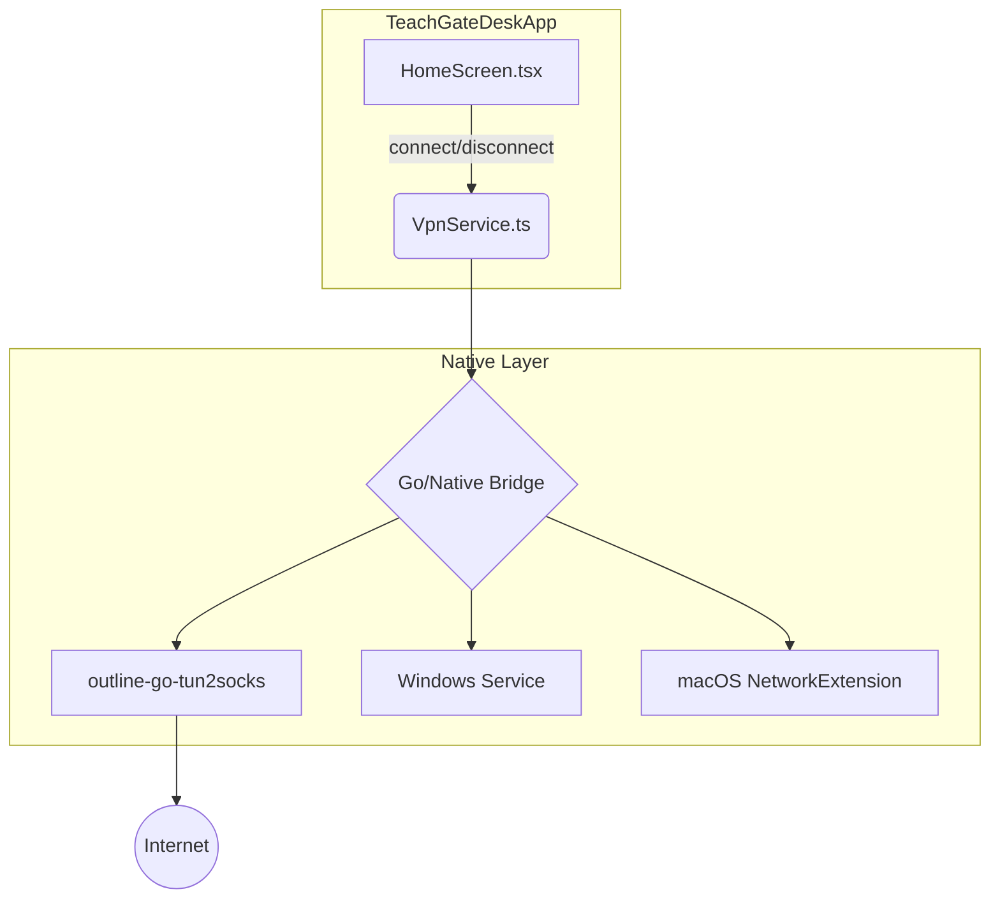
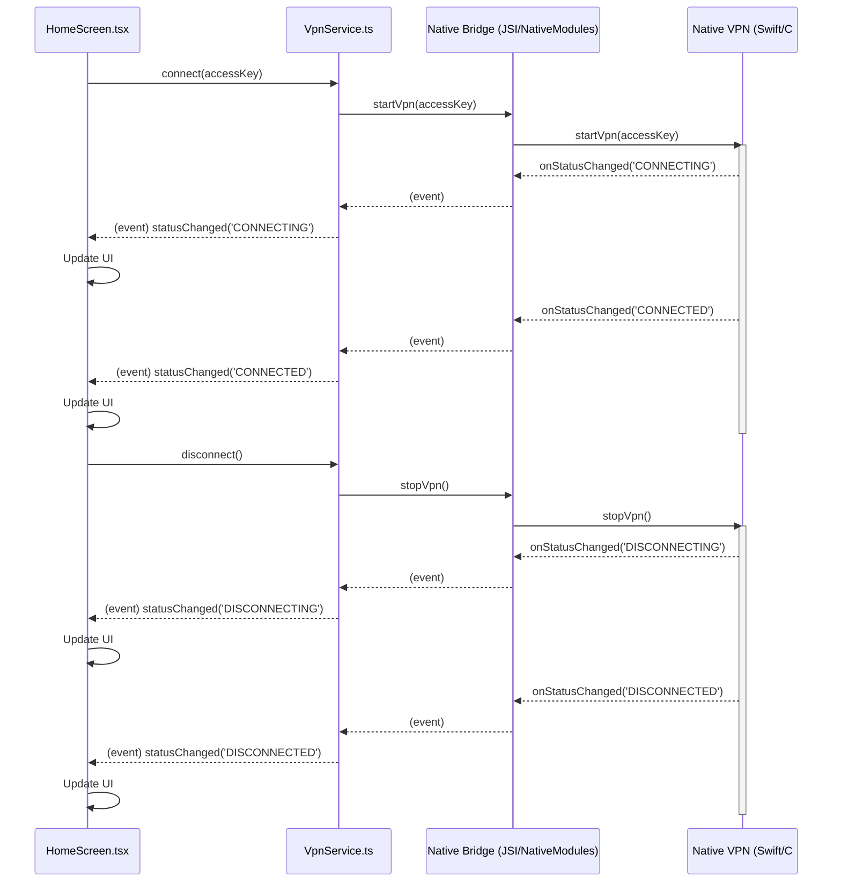

# VPN Integration Plan for TeachGateDeskApp

This document outlines the plan for integrating the VPN functionality from the `inspiration` project into the `TeachGateDeskApp`. The focus of this integration is to add a connect/disconnect toggle switch to the `HomeScreen`.

## 1. Project Analysis

### TeachGateDeskApp

- **Architecture**: React Native application for macOS and Windows.
- **Core Technologies**: React, React Native, TypeScript.
- **Key Files**:
  - `src/screens/HomeScreen.tsx`: The main screen of the application, where the VPN controls will be added.
  - `package.json`: Defines the project's dependencies.

### Inspiration Project (Outline VPN)

- **Architecture**: Hybrid application using Electron for the UI and native components for the VPN functionality.
- **Core Technologies**:
  - **UI**: Polymer (web components)
  - **Desktop**: Electron
  - **VPN Tunnel**: Go (`outline-go-tun2socks`)
  - **Windows**: C# service
  - **macOS**: Swift and Objective-C with the NetworkExtension framework.
- **Key VPN Logic**:
  - **Electron**: `inspiration/client/electron/`
    - `go_vpn_tunnel.ts`: Manages the `outline-go-tun2socks` process.
    - `vpn_service.ts`: Provides a high-level API for the VPN.
  - **Go**: `inspiration/client/go/outline/`
  - **Windows**: `inspiration/client/electron/windows/OutlineService/`
  - **macOS**: `inspiration/client/src/cordova/apple/`

## 2. Integration Plan

The integration will focus on the `HomeScreen.tsx` component. The existing toggle switch will be used to control the VPN connection.

### Step 1: Create a VPN Service Module

A new module, `src/services/vpn.ts`, will be created to encapsulate the VPN logic. This module will be responsible for:

- Communicating with the native VPN components (Go binary, Windows service, macOS NetworkExtension).
- Exposing a simple API for connecting, disconnecting, and getting the current VPN status.

This module will be a bridge between the React Native application and the underlying native VPN functionality. It will adapt the logic from the `inspiration` project's `vpn_service.ts` and `go_vpn_tunnel.ts` files.

### Step 2: Integrate the VPN Service into `HomeScreen.tsx`

The `HomeScreen.tsx` component will be modified to use the new `VpnService`.

- The `isConnected` state will be replaced with a call to the `VpnService` to get the current connection status.
- The `toggleConnection` function will be updated to call the `connect` and `disconnect` functions in the `VpnService`.
- The UI will be updated to reflect the actual VPN status, including the connection state, timer, and IP address.

## 3. Native Implementation Details

The native VPN implementation will be adapted from the `inspiration` project.

### macOS

- The `OutlineVpn.swift` and `PacketTunnelProvider.swift` files will be used as a reference for creating a new `TeachGateVpn` module.
- This module will be responsible for managing the `NEPacketTunnelProvider` and communicating with the `outline-go-tun2socks` binary.

### Windows

- The `OutlineService.cs` project will be adapted to create a new `TeachGateVpnService` for Windows.
- This service will be responsible for managing the `outline-go-tun2socks` process and the TUN/TAP device.

## 4. Mermaid Diagram: High-Level Architecture



## 5. Technical Design

This section provides a detailed technical design for integrating the Outline VPN functionality into the TeachGateDeskApp.

### 5.1. File Structure Changes

#### New Files

- **`src/services/vpn.ts`**: This will contain the main `VpnService` class, which acts as the primary interface for the UI to interact with the VPN.
- **`src/services/vpn-manager.ts`**: This module will be responsible for managing the lifecycle of the native VPN process (`outline-go-tun2socks`).
- **`src/services/types.ts`**: This file will define shared data structures and types, such as `VpnStatus` and `VpnError`.
- **`src/native/macos/TeachGateVpn/`**: A new directory to hold the macOS native VPN implementation.
  - **`TeachGateVpn.swift`**: The main Swift file for the VPN logic on macOS.
  - **`PacketTunnelProvider.swift`**: The packet tunnel provider implementation for macOS.
- **`src/native/windows/TeachGateVpnService/`**: A new directory for the Windows VPN service.
  - **`TeachGateVpnService.cs`**: The C# implementation of the VPN service for Windows.

#### Modified Files

- **`src/screens/HomeScreen.tsx`**: The main UI component will be updated to integrate with the `VpnService`.
- **`package.json`**: New dependencies for native module communication (e.g., `react-native-fs`) will be added if necessary.
- **`macos/TeachGateDeskApp.xcodeproj/project.pbxproj`**: The Xcode project will be updated to include the new Swift files and the NetworkExtension framework.
- **`windows/TeachGateDeskApp.sln`**: The Visual Studio solution will be updated to include the new C# project for the VPN service.

### 5.2. Core Components and Logic

#### `VpnService` (`src/services/vpn.ts`)

This class will be an `EventEmitter` to notify the UI of status changes.

```typescript
import EventEmitter from 'events';

export enum VpnStatus {
  CONNECTED = 'CONNECTED',
  DISCONNECTED = 'DISCONNECTED',
  CONNECTING = 'CONNECTING',
  DISCONNECTING = 'DISCONNECTING',
  ERROR = 'ERROR',
}

export class VpnService extends EventEmitter {
  private status: VpnStatus = VpnStatus.DISCONNECTED;

  async connect(accessKey: string): Promise<void> {
    // ... logic to call VpnManager
  }

  async disconnect(): Promise<void> {
    // ... logic to call VpnManager
  }

  getStatus(): VpnStatus {
    return this.status;
  }
}
```

#### `VpnManager` (`src/services/vpn-manager.ts`)

This module will handle the low-level details of running the VPN.

```typescript
import {NativeModules} from 'react-native';

const {TeachGateVpn} = NativeModules;

export async function startVpn(accessKey: string): Promise<void> {
  return TeachGateVpn.startVpn(accessKey);
}

export async function stopVpn(): Promise<void> {
  return TeachGateVpn.stopVpn();
}
```

#### `HomeScreen.tsx`

The `HomeScreen` will manage the UI state based on the `VpnService`.

```typescript
import React, {useState, useEffect} from 'react';
import {View, Switch, Text} from 'react-native';
import {VpnService, VpnStatus} from '../services/vpn';

const vpnService = new VpnService();

export function HomeScreen() {
  const [vpnStatus, setVpnStatus] = useState<VpnStatus>(VpnStatus.DISCONNECTED);

  useEffect(() => {
    const onStatusChanged = (status: VpnStatus) => setVpnStatus(status);
    vpnService.on('statusChanged', onStatusChanged);

    return () => {
      vpnService.off('statusChanged', onStatusChanged);
    };
  }, []);

  const handleToggleVpn = () => {
    if (vpnStatus === VpnStatus.CONNECTED) {
      vpnService.disconnect();
    } else if (vpnStatus === VpnStatus.DISCONNECTED) {
      vpnService.connect('YOUR_ACCESS_KEY'); // Key management to be implemented
    }
  };

  return (
    <View>
      <Text>VPN Status: {vpnStatus}</Text>
      <Switch
        value={vpnStatus === VpnStatus.CONNECTED}
        onValueChange={handleToggleVpn}
        disabled={
          vpnStatus === VpnStatus.CONNECTING ||
          vpnStatus === VpnStatus.DISCONNECTING
        }
      />
    </View>
  );
}
```

### 5.3. UI to Backend Communication Flow

The communication between the UI and the native VPN logic will be as follows:


